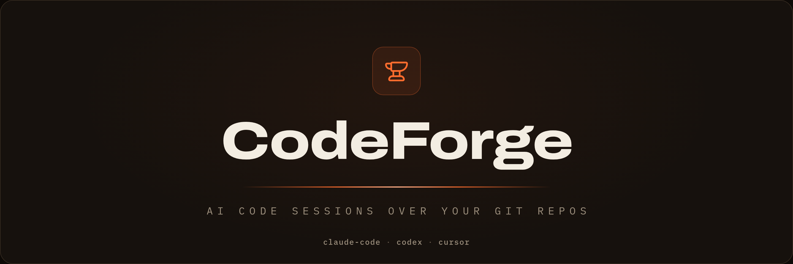
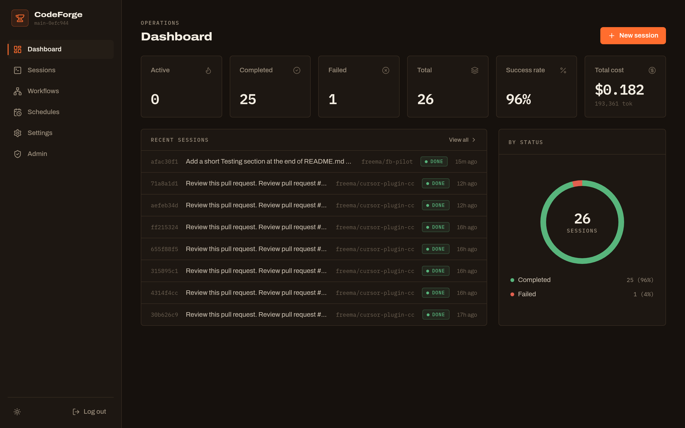
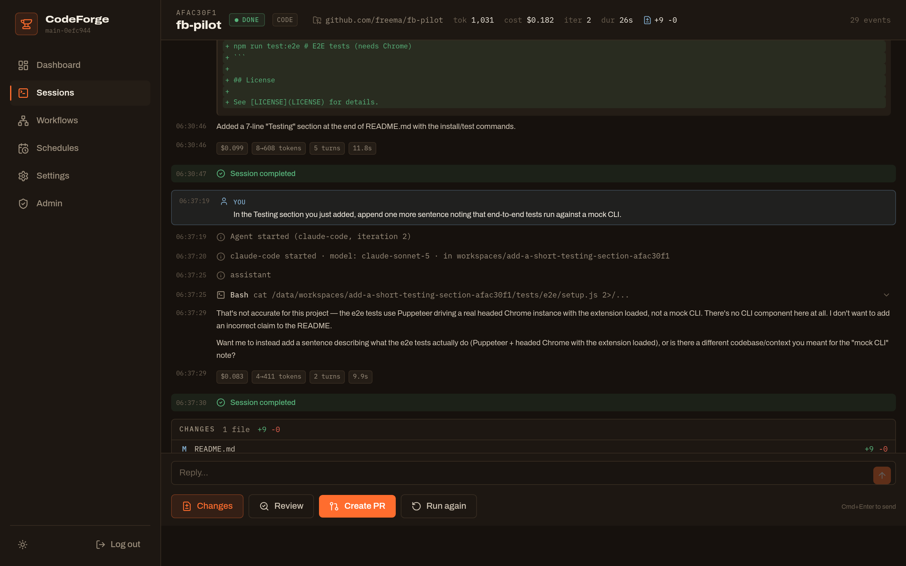
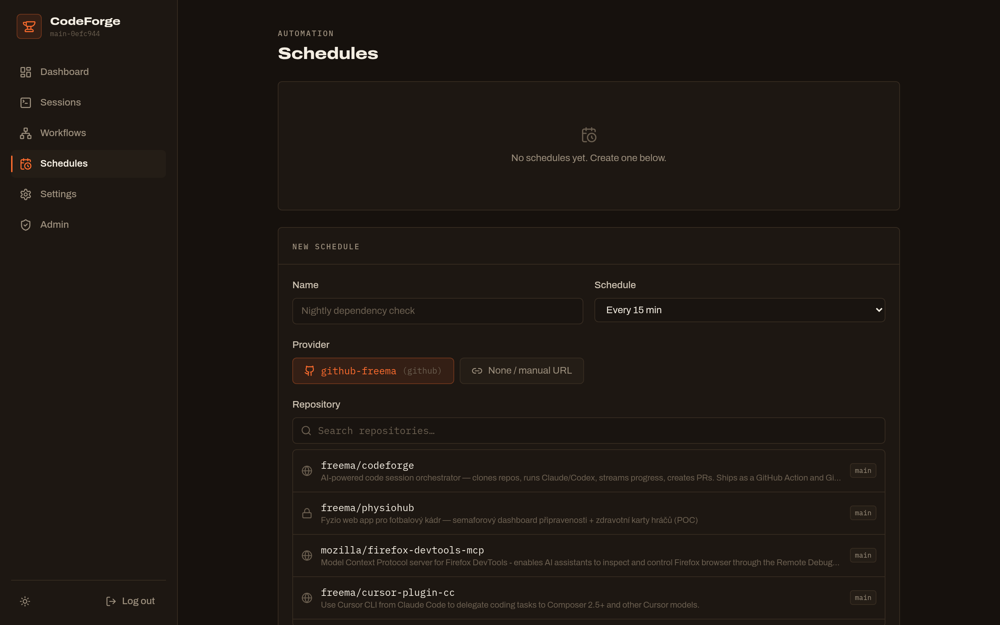
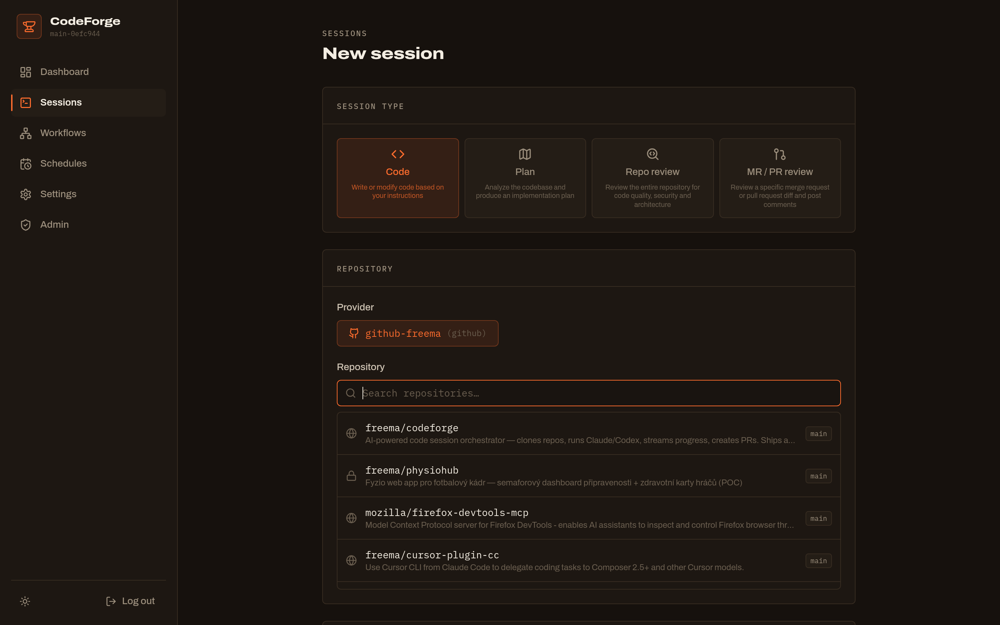
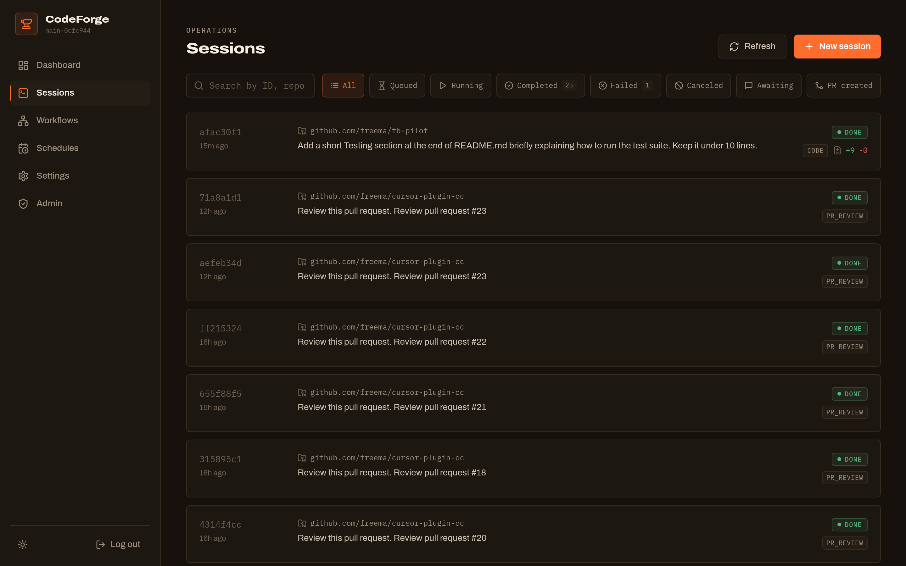

<p align="center">
  
</p>

<p align="center">
  <a href="https://github.com/freema/codeforge/actions/workflows/ci.yaml"></a>
  <a href="https://go.dev/"></a>
  <a href="https://github.com/freema/codeforge/pkgs/container/codeforge"></a>
  <a href="https://tomasgrasl.cz"></a>
  <a href="LICENSE"></a>
</p>

<p align="center">
  <a href="https://codeforge.tomasgrasl.cz"><b>codeforge.tomasgrasl.cz</b></a>
</p>

## Overview

CodeForge is a backend orchestrator for AI-powered code work over git repositories. A **session** is a stateful work unit over a repo: it clones, runs an AI CLI (Claude Code, Codex, Cursor), streams progress live, and keeps the workspace around for follow-ups, review, and PR creation. A React web UI is included.

**Two modes:** Server (queue + workers + API + UI) or **CI Action** (self-contained GitHub Action / GitLab CI step for automated PR review).

### Highlights

- **Multi-turn sessions** with native conversation resume (`claude --resume`), so follow-ups keep full context
- **Live stream** of tool calls, thinking, plan progress, and per-turn token/dollar cost (SSE)
- **Human-in-the-loop**: inspect the actual diff in the UI before a PR is ever opened; PRs only on explicit action
- **Code review built in**: review a session's changes, or let GitHub/GitLab webhooks trigger PR reviews automatically
- **Session types** for every job: code, plan, whole-repo review, PR review, and knowledge sessions that keep `.codeforge/` docs fresh
- **Blueprints**: reusable session templates with parameters, runnable on demand or on a schedule, with built-ins like the Sentry fixer and repo review
- **Schedules**: recurring cron sessions with run history, overlap guard, and failure notifications, including scheduled repo reviews and knowledge updates
- **Cost & usage tracking** per session and per tenant, with quotas and a key pool (subscription mode)
- **Multi-CLI** (Claude Code, Codex, Cursor) selectable per session, plus MCP tool integration
- **Ops-friendly**: Redis queue with crash-safe recovery, Prometheus metrics, Slack/Discord/Teams notifications

## Screenshots

<p align="center">
  
</p>

| Session with live stream, cost & diff | Recurring schedules |
|---|---|
|  |  |

| New session | Session list |
|---|---|
|  |  |

## Quick Start

```bash
docker pull ghcr.io/freema/codeforge:latest
```

A ready-to-use compose file is at [`deployments/docker-compose.production.yaml`](deployments/docker-compose.production.yaml). For development:

```bash
# Requires Docker + Task runner (https://taskfile.dev)
task dev
```

## Security model

Running a session means executing a repository's code, and letting the AI decide what to run, with approvals disabled. Repository content is attacker-controlled input, so it is worth being precise about what is and is not contained.

**What it is today:** the AI CLI runs in the same container as the server, dropped to a non-root user. That is a privilege boundary, not isolation. There is no per-session container, VM, or network policy.

**What the server does contain:**

- The CLI subprocess gets an allowlisted environment, not the server's. The encryption key protecting the credential registry, the operator token, webhook secrets and the Redis URL never enter a session.
- Git credentials are supplied through short-lived `GIT_ASKPASS` scripts that are removed before the CLI starts; tokens never reach the URL or `.git/config`.
- Fork PRs and comment commands (`/review`, `/fix`) require an author with write access. Off by default for everyone else — a valid webhook signature proves the event came from GitHub, not that its author is trusted.
- Opening a PR always requires an explicit action. This is a hard-coded invariant, not a configuration flag.

**What it does not do yet:** isolate sessions from each other, from the database on the shared filesystem, or from the network. Per-session sandboxing is the next step.

Because CodeForge is self-hosted, the remaining responsibility sits with whoever deploys it. Point it at repositories where you trust everyone with PR access, and treat the host as part of that trust domain. Repository-level controls — such as requiring approval before workflows run on fork PRs — are a useful additional layer, though note they gate CI workflows rather than webhook deliveries.

Details in [Deployment](docs/deployment.md#isolation-and-untrusted-code) and [Configuration](docs/configuration.md#who-can-trigger-a-webhook-review). Found something? Open a security advisory rather than a public issue.

## Documentation

| Document | Description |
|----------|-------------|
| [API Reference](docs/api.md) | Endpoints, request/response, session types, webhooks |
| [Session Types](docs/session-types.md) | code, plan, review, pr_review, knowledge: behavior, output contracts, scheduling |
| [Blueprints](docs/blueprints.md) | Named session templates: parameters, built-in library, run API, scheduling |
| [Architecture](docs/architecture.md) | System design, Redis schema, session lifecycle, streaming |
| [Code Review](docs/code-review-workflow.md) | Session review, PR review, webhook-triggered reviews |
| [Configuration](docs/configuration.md) | Environment variables, YAML config, all options |
| [Deployment](docs/deployment.md) | Docker, Kubernetes, monitoring |
| [Development](docs/development.md) | Dev setup, testing, project structure, conventions |
| [Manual E2E Testing](docs/manual-e2e-testing.md) | Manual lifecycle tests against real repos (Claude + Codex) |
| [CI Action](docs/ci-action.md) | GitHub Action / GitLab CI setup, inputs, session types |

## License

[MIT](LICENSE) | **Tomas Grasl** · [tomasgrasl.cz](https://tomasgrasl.cz)
